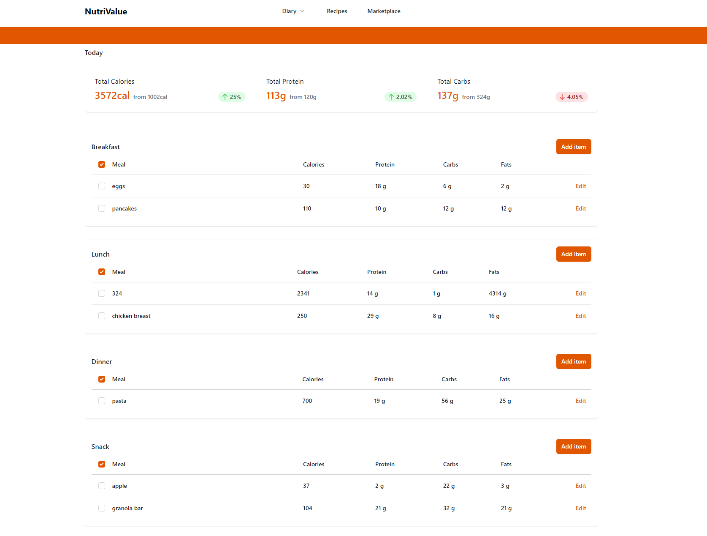

# nutrivalue

Next.js app that lets users keep track of their daily calories, search recipes, and add their own recipes.



#### [link to NutriValue server GitHub repo](https://github.com/DariusGarcia/nutrivalue-server)

## Description

I decided to build this web app to make it easy to keep count of my daily macros and meals. NutriValue allows you to input meals which keeps track of your calories, proteins, carbs, fats, etc. 

## Usage

- Create an account and add meals to your diary
- See total nutritional values

## Technologies used:

- [x] React
- [x] Nextjs
- [x] TypeScript
- [x] Node.js
- [x] Express.js
- [x] Tailwind CSS
- [x] MySQL
- [x] User Authentication
- [x] Sequelize 
- [ ] Chart.js
- [x] Client hosted on Vercel
- [x] Server deployed on Heroku

## User Stories

The following functionality is completed:

- [x] User can create an account and sign in.
- [x] The user should switch between different tabs - viewing the diary dashboard, add meal page, or home page.
- [ ] User can search recipes to add to their meals
- [x] User can add, update, and delete meals from their diary
- [x] User can view their daily nutritional stats about what they ate

# Installation

## Setting up the Client

cd into the Client/ directory and run:

add env vars 

```
NEXT_PUBLIC_SERVER_BASE_URL=http://localhost:4001
```

```
npm install
```

```
npm run dev
```
## Build for production

```
npm run build
```

## Setting up the Express Server

#### To start the server, you can cd into the Server/ directory and run:

add env vars

```
PORT=4001
HOST='127.0.0.1'
USER='root'
PASSWORD=
DATABASE='nutriValue'
JWT_SECRET_KEY=
```

```
npm install
```

```
npm run start or nodemon index.js
```
